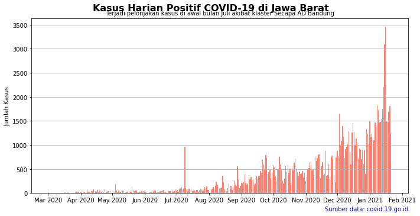
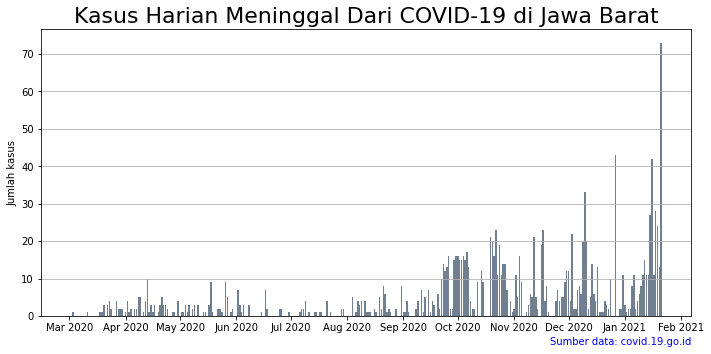
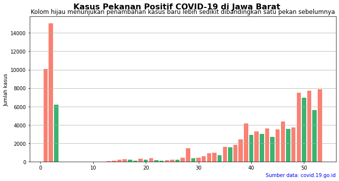
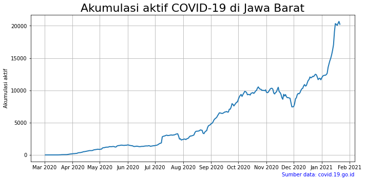
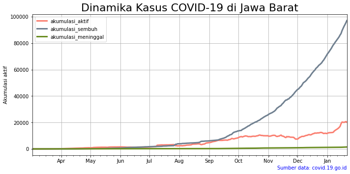

```python
import requests
resp = requests.get('https://data.covid19.go.id/public/api/update.json')
print (resp)

print(resp.headers)	

cov_id_raw = resp.json()

print('Length of cov_id_raw : %d.' %len(cov_id_raw))
print('Komponen cov_id_raw : %s.' %cov_id_raw.keys())
cov_id_update = cov_id_raw['update']

print('Tanggal pembaharuan data penambahan kasus :', cov_id_update['penambahan']['tanggal'])
print('Jumlah penambahan kasus sembuh :', cov_id_update['penambahan']['jumlah_sembuh'])
print('Jumlah penambahan kasus meninggal :', cov_id_update['penambahan']['jumlah_meninggal'])
print('Jumlah total kasus positif hingga saat ini :', cov_id_update['total']['jumlah_positif'])
print('Jumlah total kasus meninggal hingga saat ini:', cov_id_update['total']['jumlah_meninggal'])
```

    <Response [200]>
    {'Server': 'nginx', 'Date': 'Fri, 22 Jan 2021 00:47:27 GMT', 'Content-Type': 'application/json', 'Transfer-Encoding': 'chunked', 'Connection': 'keep-alive', 'Vary': 'Accept-Encoding, Accept-Encoding', 'Last-Modified': 'Fri, 22 Jan 2021 00:42:49 GMT', 'ETag': 'W/"600a1f89-1e872"', 'X-Content-Type-Options': 'nosniff, nosniff', 'X-XSS-Protection': '1; mode=block, 1; mode=block', 'Strict-Transport-Security': 'max-age=31536000; includeSubDomains; preload', 'Content-Encoding': 'gzip'}
    Length of cov_id_raw : 2.
    Komponen cov_id_raw : dict_keys(['data', 'update']).
    Tanggal pembaharuan data penambahan kasus : 2021-01-21
    Jumlah penambahan kasus sembuh : 9087
    Jumlah penambahan kasus meninggal : 346
    Jumlah total kasus positif hingga saat ini : 951651
    Jumlah total kasus meninggal hingga saat ini: 27203


```python
import requests
resp_jabar = requests.get('https://data.covid19.go.id/public/api/prov_detail_JAWA_BARAT.json')
cov_jabar_raw = resp_jabar.json()

print('Nama-nama elemen utama:\n', cov_jabar_raw.keys())
print('\nJumlah total kasus COVID-19 di Jawa Barat : %d' %cov_jabar_raw['kasus_total'])
print('Persentase kematian akibat COVID-19 di Jawa Barat : %f.2%%' %cov_jabar_raw['meninggal_persen'])
print('Persentase tingkat kesembuhan dari COVID-19 di Jawa Barat : %f.2%%' %cov_jabar_raw['sembuh_persen'])
```

    Nama-nama elemen utama:
     dict_keys(['last_date', 'provinsi', 'kasus_total', 'kasus_tanpa_tgl', 'kasus_dengan_tgl', 'meninggal_persen', 'meninggal_tanpa_tgl', 'meninggal_dengan_tgl', 'sembuh_persen', 'sembuh_tanpa_tgl', 'sembuh_dengan_tgl', 'list_perkembangan', 'data'])
    
    Jumlah total kasus COVID-19 di Jawa Barat : 118798
    Persentase kematian akibat COVID-19 di Jawa Barat : 1.250021.2%
    Persentase tingkat kesembuhan dari COVID-19 di Jawa Barat : 81.833869.2%


```python
import numpy as np
import pandas as pd
cov_jabar = pd.DataFrame(cov_jabar_raw['list_perkembangan'])
print('Info cov_jabar:\n', cov_jabar.info())
print('\nLima data teratas cov_jabar:\n', cov_jabar.head())
```

    <class 'pandas.core.frame.DataFrame'>
    RangeIndex: 326 entries, 0 to 325
    Data columns (total 9 columns):
     #   Column                        Non-Null Count  Dtype
    ---  ------                        --------------  -----
     0   tanggal                       326 non-null    int64
     1   KASUS                         326 non-null    int64
     2   MENINGGAL                     326 non-null    int64
     3   SEMBUH                        326 non-null    int64
     4   DIRAWAT_OR_ISOLASI            326 non-null    int64
     5   AKUMULASI_KASUS               326 non-null    int64
     6   AKUMULASI_SEMBUH              326 non-null    int64
     7   AKUMULASI_MENINGGAL           326 non-null    int64
     8   AKUMULASI_DIRAWAT_OR_ISOLASI  326 non-null    int64
    dtypes: int64(9)
    memory usage: 23.0 KB
    Info cov_jabar:
     None
    
    Lima data teratas cov_jabar:
              tanggal  KASUS  ...  AKUMULASI_MENINGGAL  AKUMULASI_DIRAWAT_OR_ISOLASI
    0  1583107200000      3  ...                    0                             3
    1  1583193600000      1  ...                    1                             3
    2  1583280000000      1  ...                    1                             4
    3  1583366400000      1  ...                    1                             5
    4  1583452800000      1  ...                    1                             6
    
    [5 rows x 9 columns]


```python
cov_jabar_tidy = (cov_jabar.drop(columns=[item for item in cov_jabar.columns 
                                          if item.startswith('AKUMULASI') or 
                                          item.startswith('DIRAWAT')])
.rename(columns=str.lower)
.rename(columns={'kasus': 'kasus_baru'}))
cov_jabar_tidy['tanggal'] = pd.to_datetime(cov_jabar_tidy['tanggal']*1e6, unit='ns')
print('Lima data teratas:\n', cov_jabar_tidy.head())
```

    Lima data teratas:
          tanggal  kasus_baru  meninggal  sembuh
    0 2020-03-02           3          0       0
    1 2020-03-03           1          1       0
    2 2020-03-04           1          0       0
    3 2020-03-05           1          0       0
    4 2020-03-06           1          0       0


```python
import matplotlib.pyplot as plt

plt.clf()
fig, ax = plt.subplots(figsize=(10,5))
ax.bar(data=cov_jabar_tidy, x='tanggal', height='kasus_baru')
plt.show()
```


    <Figure size 432x288 with 0 Axes>


<br/>


```python
import matplotlib.pyplot as plt
import matplotlib.dates as mdates

plt.clf()
fig, ax = plt.subplots(figsize=(10,5))
ax.bar(data=cov_jabar_tidy, x='tanggal', height='kasus_baru', color='salmon')
fig.suptitle('Kasus Harian Positif COVID-19 di Jawa Barat', 
             y=1.00, fontsize=16, fontweight='bold', ha='center')
ax.set_title('Terjadi pelonjakan kasus di awal bulan Juli akibat klaster Secapa AD Bandung',
             fontsize=10)
ax.set_xlabel('')
ax.set_ylabel('Jumlah Kasus')
ax.text(1, -0.1, 'Sumber data: covid.19.go.id', color='blue',
        ha='right', transform=ax.transAxes)

ax.xaxis.set_major_locator(mdates.MonthLocator())
ax.xaxis.set_major_formatter(mdates.DateFormatter('%b %Y'))

plt.grid(axis='y')
plt.tight_layout()
plt.show()
```


    <Figure size 432x288 with 0 Axes>





```python

import matplotlib.pyplot as plt
import matplotlib.dates as mdates

plt.clf()
fig, ax = plt.subplots(figsize=(10,5))
ax.bar(data=cov_jabar_tidy, x='tanggal', height='sembuh', color='olivedrab')
ax.set_title('Kasus Harian Sembuh Dari COVID-19 di Jawa Barat',
fontsize=22)
ax.set_xlabel('')
ax.set_ylabel('Jumlah kasus')
ax.text(1, -0.1, 'Sumber data: covid.19.go.id', color='blue',
ha='right', transform=ax.transAxes)

ax.xaxis.set_major_locator(mdates.MonthLocator())
ax.xaxis.set_major_formatter(mdates.DateFormatter('%b %Y'))

plt.grid(axis='y')
plt.tight_layout()
plt.show()
```


    <Figure size 432x288 with 0 Axes>


```python

import matplotlib.pyplot as plt
import matplotlib.dates as mdates

plt.clf()
fig, ax = plt.subplots(figsize=(10,5))
ax.bar(data=cov_jabar_tidy, x='tanggal', height='meninggal', color='slategrey')
ax.set_title('Kasus Harian Meninggal Dari COVID-19 di Jawa Barat',
fontsize=22)
ax.set_xlabel('')
ax.set_ylabel('Jumlah kasus')
ax.text(1, -0.1, 'Sumber data: covid.19.go.id', color='blue',
ha='right', transform=ax.transAxes)

ax.xaxis.set_major_locator(mdates.MonthLocator())
ax.xaxis.set_major_formatter(mdates.DateFormatter('%b %Y'))

plt.grid(axis='y')
plt.tight_layout()
plt.show()
```


    <Figure size 432x288 with 0 Axes>





```python
cov_jabar_pekanan = (cov_jabar_tidy.set_index('tanggal')['kasus_baru']
                     .resample('W').sum().reset_index()
                     .rename(columns={'kasus_baru': 'jumlah'}))
cov_jabar_pekanan['tahun'] = cov_jabar_pekanan['tanggal'].apply(lambda x: x.year)
cov_jabar_pekanan['pekan_ke'] = cov_jabar_pekanan['tanggal'].apply(lambda x: x.weekofyear)
cov_jabar_pekanan = cov_jabar_pekanan[['tahun', 'pekan_ke', 'jumlah']]

print('Info cov_jabar_pekanan:')
print(cov_jabar_pekanan.info())
print('\nLima data teratas cov_jabar_pekanan:\n', cov_jabar_pekanan.head())
```

    Info cov_jabar_pekanan:
    <class 'pandas.core.frame.DataFrame'>
    RangeIndex: 47 entries, 0 to 46
    Data columns (total 3 columns):
     #   Column    Non-Null Count  Dtype
    ---  ------    --------------  -----
     0   tahun     47 non-null     int64
     1   pekan_ke  47 non-null     int64
     2   jumlah    47 non-null     int64
    dtypes: int64(3)
    memory usage: 1.2 KB
    None
    
    Lima data teratas cov_jabar_pekanan:
        tahun  pekan_ke  jumlah
    0   2020        10       7
    1   2020        11       5
    2   2020        12      52
    3   2020        13     104
    4   2020        14     122


```python
cov_jabar_pekanan['jumlah_pekanlalu'] = cov_jabar_pekanan['jumlah'].shift().replace(np.nan, 0).astype(np.int)
cov_jabar_pekanan['lebih_baik'] = cov_jabar_pekanan['jumlah'] < cov_jabar_pekanan['jumlah_pekanlalu']

print('Sepuluh data teratas:\n', cov_jabar_pekanan.head(10))
```

    Sepuluh data teratas:
        tahun  pekan_ke  jumlah  jumlah_pekanlalu  lebih_baik
    0   2020        10       7                 0       False
    1   2020        11       5                 7        True
    2   2020        12      52                 5       False
    3   2020        13     104                52       False
    4   2020        14     122               104       False
    5   2020        15     235               122       False
    6   2020        16     277               235       False
    7   2020        17     216               277        True
    8   2020        18     156               216        True
    9   2020        19     367               156       False


```python

import matplotlib.pyplot as plt

plt.clf()
fig, ax = plt.subplots(figsize=(10,5))
ax.bar(data=cov_jabar_pekanan, x='pekan_ke', height='jumlah',
color=['mediumseagreen' if x is True else 'salmon' for x in cov_jabar_pekanan['lebih_baik']])
fig.suptitle('Kasus Pekanan Positif COVID-19 di Jawa Barat',
y=1.00, fontsize=16, fontweight='bold', ha='center')
ax.set_title('Kolom hijau menunjukan penambahan kasus baru lebih sedikit dibandingkan satu pekan sebelumnya',
fontsize=12)
ax.set_xlabel('')
ax.set_ylabel('Jumlah kasus')
ax.text(1, -0.1, 'Sumber data: covid.19.go.id', color='blue',
ha='right', transform=ax.transAxes)

plt.grid(axis='y')
plt.tight_layout()
plt.show()			
```


    <Figure size 432x288 with 0 Axes>





```python
cov_jabar_akumulasi = cov_jabar_tidy[['tanggal']].copy()
cov_jabar_akumulasi['akumulasi_aktif'] = (cov_jabar_tidy['kasus_baru'] - cov_jabar_tidy['sembuh'] - cov_jabar_tidy['meninggal']).cumsum()
cov_jabar_akumulasi['akumulasi_sembuh'] = cov_jabar_tidy['sembuh'].cumsum()
cov_jabar_akumulasi['akumulasi_meninggal'] = cov_jabar_tidy['meninggal'].cumsum()
cov_jabar_akumulasi.tail()
```


<div>
<style scoped>
    .dataframe tbody tr th:only-of-type {
        vertical-align: middle;
    }

    .dataframe tbody tr th {
        vertical-align: top;
    }

    .dataframe thead th {
        text-align: right;
    }
</style>
<table border="1" class="dataframe">
  <thead>
    <tr style="text-align: right;">
      <th></th>
      <th>tanggal</th>
      <th>akumulasi_aktif</th>
      <th>akumulasi_sembuh</th>
      <th>akumulasi_meninggal</th>
    </tr>
  </thead>
  <tbody>
    <tr>
      <th>321</th>
      <td>2021-01-17</td>
      <td>20224</td>
      <td>91012</td>
      <td>1342</td>
    </tr>
    <tr>
      <th>322</th>
      <td>2021-01-18</td>
      <td>20057</td>
      <td>92636</td>
      <td>1370</td>
    </tr>
    <tr>
      <th>323</th>
      <td>2021-01-19</td>
      <td>20355</td>
      <td>93998</td>
      <td>1394</td>
    </tr>
    <tr>
      <th>324</th>
      <td>2021-01-20</td>
      <td>20667</td>
      <td>95487</td>
      <td>1407</td>
    </tr>
    <tr>
      <th>325</th>
      <td>2021-01-21</td>
      <td>20227</td>
      <td>97082</td>
      <td>1480</td>
    </tr>
  </tbody>
</table>
</div>


```python

import matplotlib.pyplot as plt
import matplotlib.dates as mdates

plt.clf()
fig, ax = plt.subplots(figsize=(10,5))
ax.plot('tanggal', 'akumulasi_aktif', data=cov_jabar_akumulasi, lw=2)

ax.set_title('Akumulasi aktif COVID-19 di Jawa Barat',
fontsize=22)
ax.set_xlabel('')
ax.set_ylabel('Akumulasi aktif')
ax.text(1, -0.1, 'Sumber data: covid.19.go.id', color='blue',
ha='right', transform=ax.transAxes)

ax.xaxis.set_major_locator(mdates.MonthLocator())
ax.xaxis.set_major_formatter(mdates.DateFormatter('%b %Y'))

plt.grid()
plt.tight_layout()
plt.show()
```


    <Figure size 432x288 with 0 Axes>





```python
import matplotlib.pyplot as plt
import matplotlib.dates as mdates

plt.clf()
fig, ax = plt.subplots(figsize=(10,5))
cov_jabar_akumulasi.plot(x='tanggal', kind='line', ax=ax, lw=3,
color=['salmon', 'slategrey', 'olivedrab'])

ax.set_title('Dinamika Kasus COVID-19 di Jawa Barat',
fontsize=22)
ax.set_xlabel('')
ax.set_ylabel('Akumulasi aktif')
ax.text(1, -0.1, 'Sumber data: covid.19.go.id', color='blue',
ha='right', transform=ax.transAxes)

ax.xaxis.set_major_locator(mdates.MonthLocator())
ax.xaxis.set_major_formatter(mdates.DateFormatter('%b'))

plt.grid()
plt.tight_layout()
plt.show()
```


    <Figure size 432x288 with 0 Axes>




